# Authentication Flow - Complete Architecture Guide

## 🎯 The Flickering Problem & Solution

### What Was Causing the Flickering?

**The Problem:**
You had **two navigation mechanisms** working at the same time:

1. **Declarative Navigation** (React-style):
```typescript
// In callback.tsx - BEFORE
if (isAuthenticated && user?.emailVerified) {
  return <Redirect href="/home" />
}
```

2. **Imperative Navigation** (JavaScript-style):
```typescript
// Also in callback.tsx - BEFORE
router.replace('/home');
```

**Why This Caused Flickering:**

```
1. OAuth callback completes → saves session
2. Component re-renders (state changed)
3. Checks: isAuthenticated? Yes → <Redirect href="/home" />
4. ALSO runs: router.replace('/home')
5. Result: TWO navigations happen! → FLICKER!
```

### The Solution: Pick ONE Navigation Pattern

I chose **imperative navigation** (`router.replace()`) because:
- ✅ Immediate - doesn't wait for React re-render
- ✅ Cleaner - one navigation path
- ✅ Better UX - faster transition

**After Fix:**
```typescript
// callback.tsx - AFTER
useEffect(() => {
  const handleAuth = async () => {
    // ... save session ...
    router.replace('/home'); // ✅ Only ONE navigation
  };
}, []);

// ✅ Removed the conditional <Redirect> components
// Just show loading spinner
return <LoadingSpinner />
```

---

## 🏗️ App Initialization: The Confusing Part

### Component Hierarchy - Visual Tree


### The Loading States Problem

**Why Your App Had Multiple Loading States:**


### State Flow Timeline - This is Where You Got Stuck!

```mermaid
sequenceDiagram
    participant App as App Startup
    participant Layout as _layout.tsx
    participant Providers as AppProviders
    participant AuthStore as useAuthStore
    participant SecureStore
    participant Index as index.tsx
    participant Collections as CollectionsProvider
    participant Electric as ElectricSQL
    
    Note over App: 📱 App Opens
    
    App->>Layout: Mount _layout.tsx
    activate Layout
    
    Layout->>Layout: useEffect(() => { setLoaded(true) })
    Note over Layout: fonts.loaded && appIsReady
    
    Layout->>Providers: Render <AppProviders>
    activate Providers
    
    Providers->>AuthStore: Initialize Zustand store
    activate AuthStore
    
    AuthStore->>SecureStore: getItemAsync("token")
    Note over SecureStore: ASYNC - This takes time!
    
    SecureStore-->>AuthStore: Return stored token
    AuthStore->>AuthStore: setState({ user, token, hasHydrated: true })
    
    Note over AuthStore: ⚠️ State Update → Re-render!
    
    deactivate AuthStore
    
    Providers->>Index: Render index.tsx
    activate Index
    
    Index->>Index: useAppInitialization()
    Note over Index: Check isReady
    
    alt Not Ready
        Index-->>Providers: Return <LoadingScreen />
    else Ready & Authenticated
        Index->>Collections: Render <CollectionsProvider>
        activate Collections
        
        Collections->>AuthStore: Get token from state
        Collections->>Electric: Create collections with token
        
        Electric->>Electric: Initialize sync
        
        Collections-->>Index: Render children
        deactivate Collections
        
        Index-->>Providers: Navigate to /home
    end
    
    deactivate Index
    deactivate Providers
    deactivate Layout
```



### The useEffect Execution Order - Critical Understanding!

```mermaid
graph TB
    A[Component Mounts] --> B[1. Run JSX/TSX code]
    B --> C[2. Render elements]
    C --> D[3. Update DOM]
    D --> E{useEffect with [] deps?}
    E -->|Yes| F[4. Run effect AFTER render]
    E -->|No| G[4. Run effect on EVERY render]
    F --> H[Effect runs async]
    G --> H
    
    H --> I{State change in effect?}
    I -->|Yes| J[Trigger re-render]
    J --> B
    I -->|No| K[Done]
    
    style A fill:#4ecdc4
    style F fill:#ff6b6b
    style J fill:#ffeaa7
```

**Example from _layout.tsx:**

```typescript
export default function RootLayout() {
  const [loaded, setLoaded] = useState(false);
  
  // ❓ WHEN does this run?
  useEffect(() => {
    const prepare = async () => {
      // This runs AFTER component renders
      // If this takes 2 seconds, you see loading for 2 seconds!
      await someAsyncWork();
      setLoaded(true); // ← Triggers re-render!
    };
    prepare();
  }, []); // ← Empty array = run ONCE after mount
  
  // This renders BEFORE useEffect runs
  if (!loaded) return null;
  
  return <AppProviders>...</AppProviders>
}
```

### AppProviders State Management - The Zustand Hydration


**Visual Code Flow:**

```typescript
// AppProviders.tsx
export function AppProviders({ children }) {
  const hasHydrated = useAuthStore(s => s.hasHydrated);
  
  // 🎬 Step 1: Component renders BEFORE hydration
  console.log('Render:', { hasHydrated }); // false
  
  // 🎬 Step 2: Zustand persist middleware reads SecureStore
  // (This happens in the background)
  
  // 🎬 Step 3: When SecureStore responds, state updates
  // hasHydrated changes from false → true
  
  // 🎬 Step 4: State change triggers re-render
  console.log('Render:', { hasHydrated }); // true
  
  if (!hasHydrated) {
    // First render - show loading
    return <LoadingScreen />;
  }
  
  // Second render - show app
  return (
    <CollectionsProvider>
      {children}
    </CollectionsProvider>
  );
}
```

### The Race Conditions - Why Things Break

```mermaid
graph TD
    A[CollectionsProvider Mounts] --> B{Has Auth Token?}
    B -->|No| C[❌ Create collections with null token]
    B -->|Yes| D[✅ Create collections with token]
    
    C --> E[ElectricSQL Request]
    E --> F[Backend: 401 Unauthorized]
    
    D --> G[ElectricSQL Request with token]
    G --> H[Backend: 200 OK]
    
    style C fill:#ff6b6b,color:#fff
    style F fill:#ff6b6b,color:#fff
    style D fill:#96ceb4,color:#fff
    style H fill:#96ceb4,color:#fff
```



**Timeline of the Race:**

```
Time 0ms:   App starts
Time 10ms:  _layout mounts
Time 20ms:  AppProviders mounts
Time 30ms:  🔥 CollectionsProvider mounts (token still null!)
Time 500ms: SecureStore responds with token
Time 510ms: State updates: { token: "abc123" }
Time 520ms: 😱 TOO LATE! Collections already created with null
```

**The Fix - Wait for Token:**

```typescript
// CollectionsProvider.tsx
export function CollectionsProvider({ children }) {
  const token = useAuthStore(s => s.token);
  
  useEffect(() => {
    // ✅ Only create collections when we have a token
    if (!token) return;
    
    const collections = createCollections(token);
    _setCollections(collections);
  }, [token]); // ← Run when token changes
  
  return children;
}
```

---

## 🔄 Complete Flow: From App Launch to Data Display

```mermaid
flowchart TD
    Start([User Opens App]) --> Layout[_layout.tsx Mounts]
    
    Layout --> LoadFonts{Fonts Loaded?}
    LoadFonts -->|No| WaitFonts[Show Splash]
    WaitFonts --> LoadFonts
    LoadFonts -->|Yes| RenderProviders[Render AppProviders]
    
    RenderProviders --> ZustandInit[Zustand Store Initializes]
    ZustandInit --> ReadSecure[Read SecureStore]
    
    ReadSecure --> HasToken{Token Found?}
    HasToken -->|No| ShowLogin[Navigate to /sign-in]
    HasToken -->|Yes| HydrateState[Hydrate: user + token]
    
    HydrateState --> SetHydrated[hasHydrated = true]
    SetHydrated --> ReRenderApp[Re-render AppProviders]
    
    ReRenderApp --> IndexCheck[index.tsx Checks isReady]
    IndexCheck --> CollectionsMount[CollectionsProvider Mounts]
    
    CollectionsMount --> CreateCollections[Create Electric Collections]
    CreateCollections --> ElectricInit[ElectricSQL.init with token]
    
    ElectricInit --> SyncRequest[HTTP: GET /api/electric/tasks?token=...]
    SyncRequest --> BackendValidate[Backend validates token]
    
    BackendValidate --> FilterData[Filter by userId]
    FilterData --> ReturnData[Return user's data]
    
    ReturnData --> ElectricStore[ElectricSQL stores data locally]
    ElectricStore --> HomeRender[HomeScreen reads from Electric]
    
    HomeRender --> DisplayData([User Sees Data! 🎉])
    
    ShowLogin --> UserLogin[User Logs In]
    UserLogin --> SaveToken[Save token to SecureStore + Zustand]
    SaveToken --> HydrateState
    
    style Start fill:#4ecdc4,color:#fff
    style DisplayData fill:#96ceb4,color:#fff
    style ShowLogin fill:#ffeaa7,color:#000
    style BackendValidate fill:#ff6b6b,color:#fff
```



---

## 🔐 OAuth Authentication Flow

### High-Level Flow


### Detailed Sequence Diagram


---

## 🔑 Key Concepts Explained

### 1. Declarative vs Imperative Navigation

**Declarative (React-style):**
```typescript
// You DESCRIBE what should happen
if (condition) {
  return <Redirect href="/home" />
}
```
- Pros: React-y, easy to read
- Cons: Depends on component re-render, can be slow

**Imperative (JavaScript-style):**
```typescript
// You COMMAND what to do
router.replace('/home');
```
- Pros: Immediate, precise control
- Cons: Less React-y, must manage manually

### 2. Why We Use Both SecureStore AND Zustand

```typescript
// Save to BOTH places
await SecureStore.setItemAsync("token", token);  // ← Persist on disk
useAuthStore.setState({ token });                 // ← In-memory state
```

**Why Both?**

| Storage | Purpose | Survives App Close? | Speed |
|---------|---------|---------------------|-------|
| **SecureStore** | Long-term persistence | ✅ YES | Slow (async disk I/O) |
| **Zustand** | React state management | ❌ NO | Fast (in memory) |

**Flow:**
1. First app launch → Read from SecureStore (slow)
2. During session → Read from Zustand (fast)
3. On logout → Clear BOTH

### 3. OAuth Token vs Session Token

This was the BIG discovery:

```typescript
// OAuth callback gives you THIS:
const oauthToken = "g1zHYaaWyIcvQbbVcFoMCAdr0PDXVXI0.dekkKN488tcI..." // 77 chars

// But better-auth database stores THIS:
const sessionToken = "g1zHYaaWyIcvQbbVcFoMCAdr0PDXVXI0" // 32 chars
```

**The Fix:**
```typescript
// ❌ WRONG - Use OAuth token directly
const token = params.cookie.extractToken();

// ✅ RIGHT - Get actual session token from better-auth
const { data: session } = await authClient.getSession();
const token = session.session.token; // ← This is the 32-char one!
```

---

## 📊 State Management Flow


---

## 🎓 Best Practices Applied

### 1. Single Source of Truth
```typescript
// ✅ GOOD - One place decides auth state
const { isAuthenticated } = useAuth();

// ❌ BAD - Multiple places checking auth
if (user && token) { }
if (SecureStore.getItem("token")) { }
```

### 2. Lazy Initialization for Auth-Dependent Resources
```typescript
// ❌ BAD - Initialize at module load
export const taskCollection = electricClient.collection(...)

// ✅ GOOD - Wait for auth token
useEffect(() => {
  if (token) {
    const collection = electricClient.collection(...)
  }
}, [token]);
```

### 3. Immediate Feedback with Optimistic UI
```typescript
// Save state immediately (optimistic)
useAuthStore.setState({ user, token });

// Navigate without waiting
router.replace('/home');

// Sync in background
queryClient.invalidateQueries();
```

---

## 🔍 Debugging Tips

### How to Debug Navigation Issues

1. **Add logging at navigation points:**
```typescript
console.log('[NAVIGATION] About to navigate to:', route);
router.replace(route);
console.log('[NAVIGATION] Navigation called');
```

2. **Check for multiple navigation calls:**
```bash
# In logs, look for:
[NAVIGATION] About to navigate to: /home
[NAVIGATION] About to navigate to: /home  # ← DUPLICATE!
```

3. **Use React DevTools:**
- Watch component re-renders
- Check state changes
- Identify unnecessary re-renders

### How to Debug Token Issues

```typescript
// Log token details
console.log({
  tokenLength: token.length,
  firstChars: token.substring(0, 20),
  source: 'authClient.getSession'
});

// Verify it matches database
// Database token is always 32 chars for better-auth
```

---

## 📝 Summary

### What We Fixed

1. **Flickering** → Removed duplicate navigation (declarative + imperative)
2. **OAuth Token Issue** → Used `authClient.getSession()` for correct token
3. **Collection Timing** → Created `CollectionsProvider` for lazy init
4. **Code Quality** → Removed debug logs, kept error handling

### Key Takeaways

- ✅ Pick ONE navigation pattern (we chose imperative)
- ✅ Use `authClient.getSession()` for OAuth, not manual parsing
- ✅ Initialize auth-dependent resources AFTER auth is ready
- ✅ Keep both SecureStore (persistence) and Zustand (performance)
- ✅ Navigate immediately for better UX, sync in background
- ✅ Understand useEffect timing to avoid race conditions
- ✅ Use visual diagrams when architecting complex flows

---

## 📖 How to View These Diagrams

The mermaid diagrams in this file will render as **actual visual diagrams** in:

- ✅ **GitHub** - Open this file on GitHub to see rendered diagrams
- ✅ **VS Code** - Install "Markdown Preview Mermaid Support" extension
- ✅ **GitLab** - Native mermaid support
- ✅ **Obsidian** - Native support
- ✅ **Most modern markdown viewers**

To view in VS Code:
1. Install extension: `bierner.markdown-mermaid`
2. Open this file
3. Press `Ctrl+Shift+V` (or `Cmd+Shift+V` on Mac)
4. See beautiful visual diagrams!
