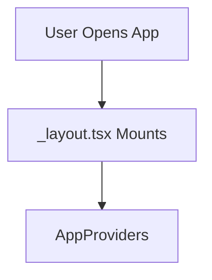

# Viewing the Visual Diagrams

## ✅ The Diagrams ARE Saved! They're Just Hidden in Plain Text

The markdown file (`AUTH_FLOW_ARCHITECTURE.md`) contains **mermaid** diagrams. These are special code blocks that **automatically render as beautiful visual diagrams** in most modern tools.

## 📊 How to See the Visuals

### Option 1: GitHub (Easiest)
1. Push the docs to GitHub
2. Open `docs/AUTH_FLOW_ARCHITECTURE.md` on GitHub
3. **All diagrams render automatically!** 🎉

### Option 2: VS Code (Installed for you)
I just installed the extension for you! Now:

1. Open `docs/AUTH_FLOW_ARCHITECTURE.md` in VS Code
2. Press `Ctrl+Shift+V` (or `Cmd+Shift+V` on Mac)
3. **See all diagrams rendered!** 🎉

### Option 3: Online Mermaid Editor
1. Copy any `mermaid` code block from the file
2. Go to https://mermaid.live
3. Paste and see instant visual diagram

## 🎨 Example of What You'll See

**What's in the file (text):**

**What renders (actual diagram):**
A flowchart with boxes and arrows showing the app flow!

## 📄 Why Not PDF?

**Markdown with Mermaid is BETTER because:**
- ✅ **Searchable** (PDF text is hard to search)
- ✅ **Editable** (update diagrams easily)
- ✅ **Version Control** (Git tracks changes)
- ✅ **Renders on GitHub** (team can view instantly)
- ✅ **Copy-paste code** (can't do from PDF)
- ✅ **Always up-to-date** (PDF gets stale)

**PDF is static. Markdown is alive!**

## 🚀 Try It Now

1. **In VS Code:** Open `docs/AUTH_FLOW_ARCHITECTURE.md`
2. **Press:** `Ctrl+Shift+V` (Windows/Linux) or `Cmd+Shift+V` (Mac)
3. **Scroll down:** You'll see 7+ beautiful diagrams!

The visuals are there - you just need the right viewer! 🎯
