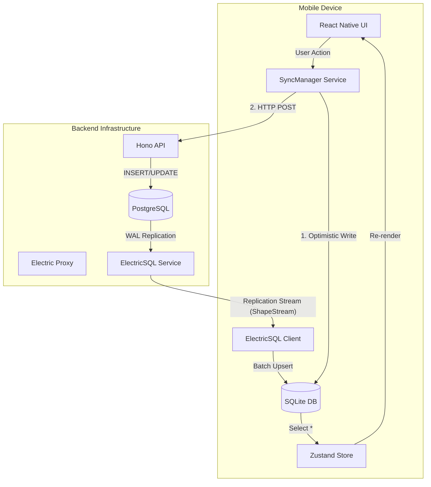
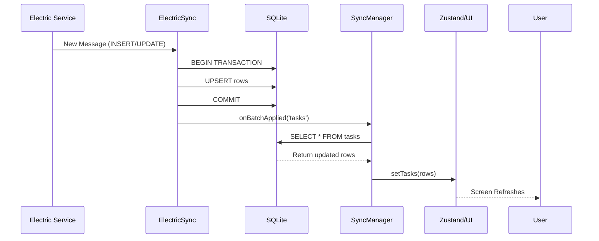

# Offline-First Architecture Masterclass: The SelfTracker Guide

> **Target Audience**: Senior Developers & Architects
> **Goal**: To understand, maintain, and extend the Offline-First capabilities of SelfTracker.

---

## 1. Introduction: The "Local-First" Philosophy

In modern mobile development, the "Request -> Loader -> Result" pattern is obsolete for productivity apps. Users expect immediate responsiveness regardless of their network status.

**Local-First** means:
1.  **Primary Data Source**: The device's local database (SQLite) is the single source of truth for the UI.
2.  **Network as an Enhancement**: The network is just a mechanism to synchronize state with other devices/servers, not a blocker for user interaction.
3.  **Eventually Consistent**: We accept that the server and client might be temporarily out of sync, but they will converge.

### The Stack

| Component | Technology | Role |
| :--- | :--- | :--- |
| **Local DB** | `expo-sqlite` (SQLite) | Persistent storage on the device. Faster than any API call. |
| **KV Store** | `MMKV` | Ultra-fast synchronous storage for "Level 1" cache (Zustand Hydration). |
| **State Management** | `Zustand` | In-memory store. Hydrates from MMKV on boot, syncs to SQLite. |
| **Sync Engine** | `ElectricSync` (Custom) | Manages the partial replication stream from `@electric-sql/client`. |
| **API** | `Hono` (Node/Bun) | Standard REST API for "Write-Through" operations. |
| **Server State** | `@tanstack/react-query` | Used for non-persistent server-side data (e.g. server status checks). |

---

## 2. High-Level Architecture

The system uses a **Hybrid Write-Through** strategy. We optimize for *Read Latency* by serving everything from local DB, and we optimize for *Write Safety* by attempting to push to the server immediately while still updating the local UI optimistically.



---

## 3. Deep Dive: The Data Flow

### 3.1 The Write Path (Optimistic Updates)

When a user creates a task, we do not wait for the server.

1.  **Generate ID**: We generate a UUID v4 locally.
2.  **Local Commit**: `SyncManager` writes to SQLite immediately.
3.  **UI Update**: `Zustand` updates (often triggered by reloading from DB or manual set).
4.  **Network Push**: `SyncManager` sends the data to the API.

**Code Example: `SyncManager.pushTask`**

```typescript
// mobile/src/services/SyncManager.ts

async pushTask(task: Task) {
  // 1. Optimistic Local Write (Critical for UX)
  // We use INSERT OR REPLACE to handle potential re-syncs or edits
  await this.db.runAsync(`
    INSERT OR REPLACE INTO tasks (id, title, completed, ...)
    VALUES (?, ?, ?, ...)
  `, [task.id, task.title, task.completed, ...]);

  // 2. Refresh the In-Memory Store
  // This ensures the UI reflects the change immediately
  const updatedTasks = await this.db.getAllAsync('SELECT * FROM tasks ...');
  useTasksStore.getState().setTasks(updatedTasks);

  // 3. Network Sync (Write-Through)
  // We trigger this *after* the UI update so the user isn't blocked.
  try {
    await axiosInstance.post('/api/tasks', task);
  } catch (e) {
    // If this fails, the data is still safe in SQLite.
    // Ideally, we add this to a 'PendingMutationQueue' (See Future Improvements).
    console.error("Background sync failed:", e);
  }
}
```

### 3.2 The Read Path (Reactive Sync)

We don't "poll" for data. We open a long-lived HTTP streaming connection (via ElectricSQL) that pushes changes to us.

**Sequence:**
1.  **Subscription**: The app boots and `ElectricSync` connects to the backend proxy.
2.  **Stream**: Postgres detects a change -> Electric Service -> Client Stream.
3.  **Apply**: `ElectricSync` applies a batch of changes to SQLite in a single transaction.
4.  **Notify**: `SyncManager` detects the DB change and refreshes the Zustand store.



**Code Example: `ElectricSync.applyMessages`**

The magic happens in how we handle incoming data. We use **Upserts** to ensure robustness.

```typescript
// mobile/src/db/client.ts

private async applyMessages(tableName: string, messages: Message[]) {
  await this.db.withTransactionAsync(async () => {
    for (const msg of messages) {
      if (msg.headers.operation === 'insert' || msg.headers.operation === 'update') {
        // We construct a dynamic UPSERT query
        // ON CONFLICT(id) DO UPDATE SET ...
        await this.upsert(tableName, msg.value);
      } else if (msg.headers.operation === 'delete') {
        await this.delete(tableName, msg.value.id);
      }
    }
  });
  
  // Notify the listener (SyncManager) to refresh the UI
  this.onBatchApplied?.(tableName);
}
```

---

## 4. Backend Implementation & Security

### 4.1 The Proxy Pattern

We do not expose the ElectricSQL service port directly to the public internet because it often lacks granular, application-level auth logic. Instead, we proxy it through Hono.

**File:** `backend/src/routes/electric.ts`

**Responsibilities:**
1.  **Authentication**: Validates the JWT (`Authorization: Bearer ...`).
2.  **Tenant Isolation**: Injects `where user_id = 'XYZ'` into the Electric query parameters. This ensures User A never receives User B's data stream.

```typescript
// backend/src/routes/electric.ts

electricRouter.get("/:table", async (c) => {
  const user = c.get("user"); // Extracted from JWT
  
  const origin = new URL(ELECTRIC_SERVICE_URL);
  
  // Security Enforcement
  origin.searchParams.set("table", c.req.param("table"));
  origin.searchParams.set("where", `user_id='${user.id}'`);
  
  // Proxy the request
  const res = await fetch(origin.toString());
  return new Response(res.body, { ... });
});
```

---

## 5. Best Practices & Patterns

### 5.1 Why "Write-Through" and not just "Sync"?
We use "Write-Through" (sending a POST request immediately) because:
-   **Speed**: API endpoints are often faster to trigger server-side side effects (emails, notifications) than waiting for DB replication.
-   **Validation**: The API can return 400 Bad Request immediately if data is invalid (though we also validate locally with Zod).
-   **Legacy Compatibility**: It works with standard REST architectures.

### 5.2 Handling IDs (UUIDs)
**Rule**: Always generate IDs on the client.
Never rely on the server to generate IDs (like auto-increment integers) for offline-first apps. You cannot calculate the ID offline if the database generates it. We use UUID v4 strings.

### 5.3 Schema Parity
Your local `schema.ts` (Zod/SQLite) **MUST** match your backend Postgres schema.
-   If you add a column `priority` to Postgres, you **must** add it to `mobile/src/db/schema.ts` and the `CREATE TABLE` script in `SyncManager`.
-   If they diverge, the sync stream might try to write to a non-existent local column, causing the batch to fail.

---

## 6. Future Improvements (The "Senior" Checklist)

To make this system truly enterprise-grade, consider implementing:

1.  **Offline Mutation Queue**: 
    -   Currently, if `axios.post` fails, we just log an error. The local DB has the data, but the server doesn't.
    -   *Fix*: Create a `mutations` table. Store the request there. A background job (`setInterval` or `NetInfo` change) retries pending mutations until success.

2.  **Conflict Resolution Strategy**:
    -   Currently: "Last Write Wins" (mostly controlled by Server arrival).
    -   *Fix*: Add a `updated_at` timestamp comparison. If `remote.updated_at > local.updated_at`, assume remote is newer. But often, complex apps need field-level merging.

3.  **Schema Migrations**:
    -   Currently: We use `CREATE TABLE IF NOT EXISTS`.
    -   *Fix*: Implement a versioned migration system (e.g., `user_version` pragma in SQLite) to handle `ALTER TABLE` commands when you ship app updates.

---

*This documentation is part of the SelfTracker internal knowledge base.*
