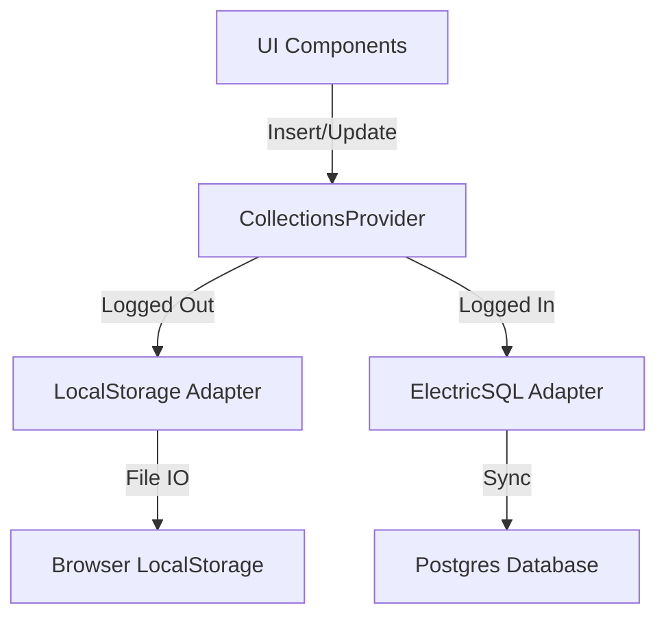
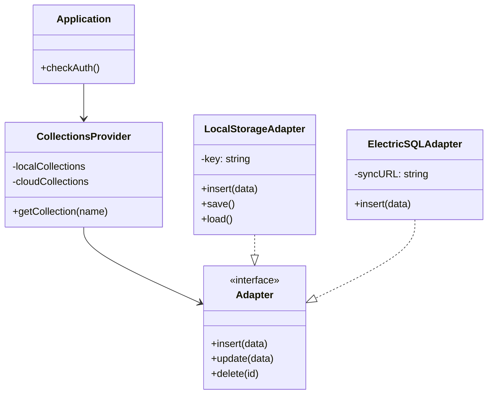

# Offline-First Desktop Architecture

## Overview
SelfTracker Desktop is built with an **Offline-First** philosophy. This means:
1.  **Guest Users**: Can use the full app without seeing "Login" screens immediately. Data is stored locally.
2.  **Authenticated Users**: Can use the app offline. Data syncs to the backend when online.

This document serves as the architectural reference for how we achieve this using **TanStack Store**, **ElectricSQL**, and our custom **LocalStorage Adapter**.

## Architecture Layers

### 1. The Abstraction Layer (`CollectionsProvider`)
The UI components never speak to the database directly. They use the `CollectionsProvider` context.
This separate allows us to swap the underlying storage engine based on the user's auth state without breaking the UI.



## 2. Guest Mode: The "LocalStorage Adapter"
For guest users, we use a custom implementation of `createCollection`. Since TanStack Store is in-memory by default, we "monkey-patch" the mutation methods to persist data to `localStorage`.

### Implementation Pattern (Interceptor)
We intercept database calls to save a snapshot to disk.

```typescript
// Conceptual Implementation
const createLocalCollection = (id, schema) => {
  const col = createCollection({ id, schema });
  
  // 1. Intercept Insert
  const originalInsert = col.insert;
  col.insert = (data) => {
    // Write to Memory (UI Update)
    const res = originalInsert(data);
    
    // Write to Disk (Persistence)
    const current = loadFromDisk();
    current.push(data);
    saveToDisk(current);
    
    return res;
  };
  
  // 2. Load on Init
  const initialData = loadFromDisk();
  col.upsert(initialData);
  
  return col;
};
```

**Pros**:
*   Zero setup for the user.
*   Data survives app restarts.
*   Synchronous execution (avoids UI race conditions).

**Limitations**:
*   LocalStorage has a ~5MB limit (approx. 50k tasks).
*   Structure is simple JSON strings.

## 3. The Upgrade Path: Migration
When a guest user decides to log in, we must not lose their data.

**The Workflow**:
1.  User Logs In -> Auth Token received.
2.  Provider switches to **ElectricSQL Adapter**.
3.  **Migration Trigger**:
    *   App checks for `localStorage` data presence.
    *   If found, it iterates through local items.
    *   It updates `user_id` from "local" to the real UUID.
    *   It inserts them into the ElectricSQL collection.
    *   ElectricSQL syncs them to the Cloud.
    *   `localStorage` is cleared.

## UML Class Diagram



## Future Considerations
For massive scalability beyond the 5MB limit for guests, we can transparently swap the `LocalStorageAdapter` for an `IndexedDBAdapter`. Because of the provider abstraction, **no UI code will need to change**.
